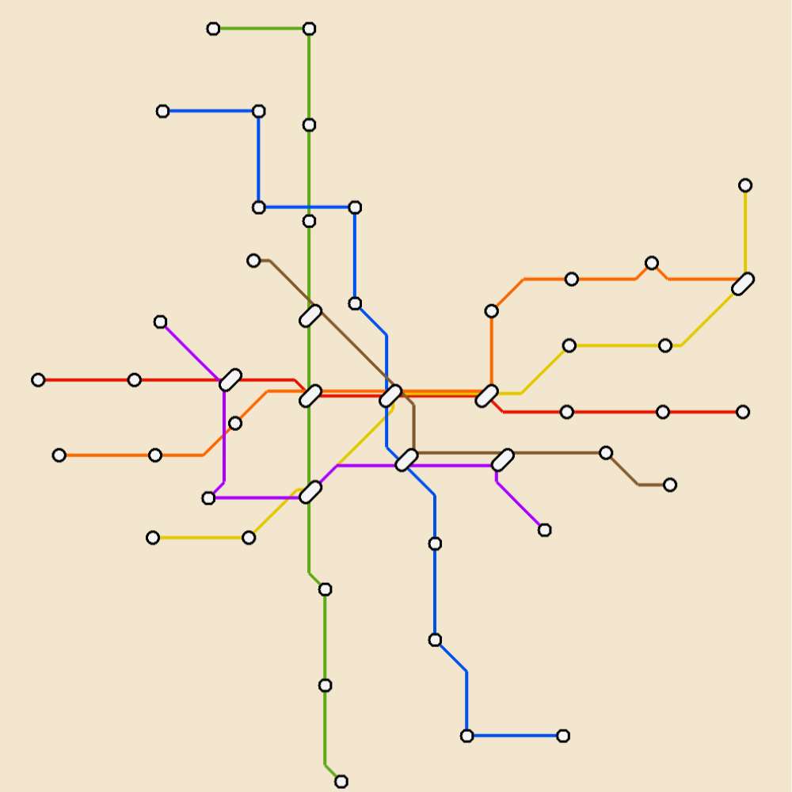
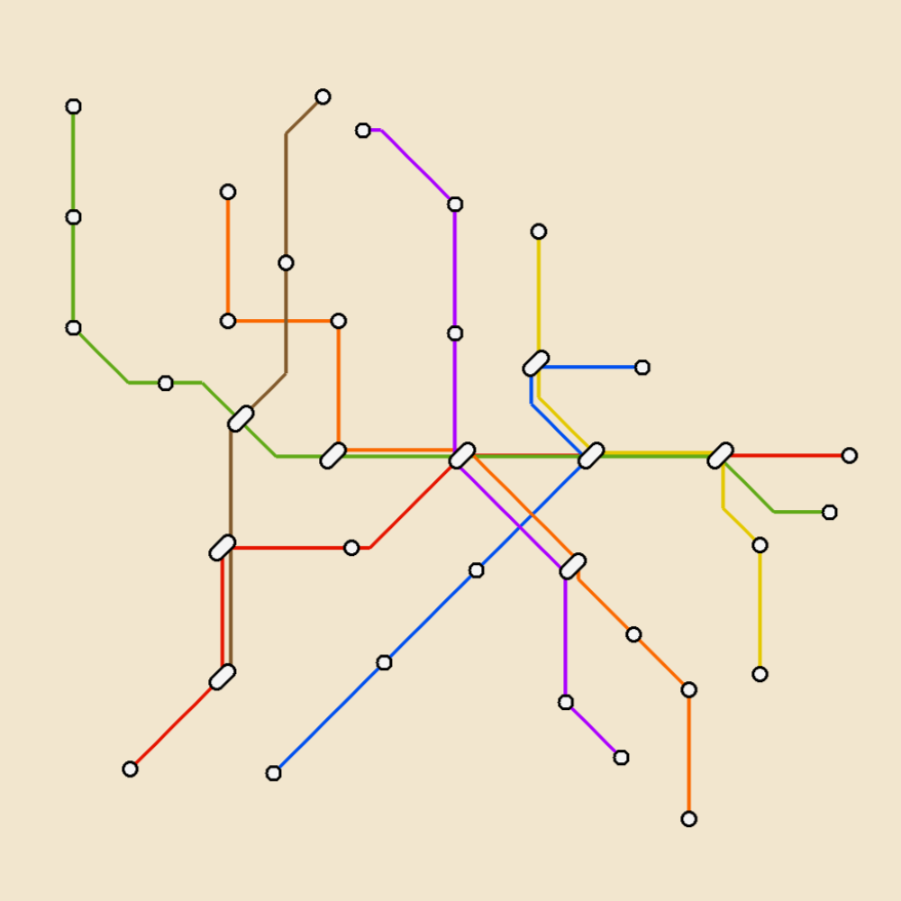
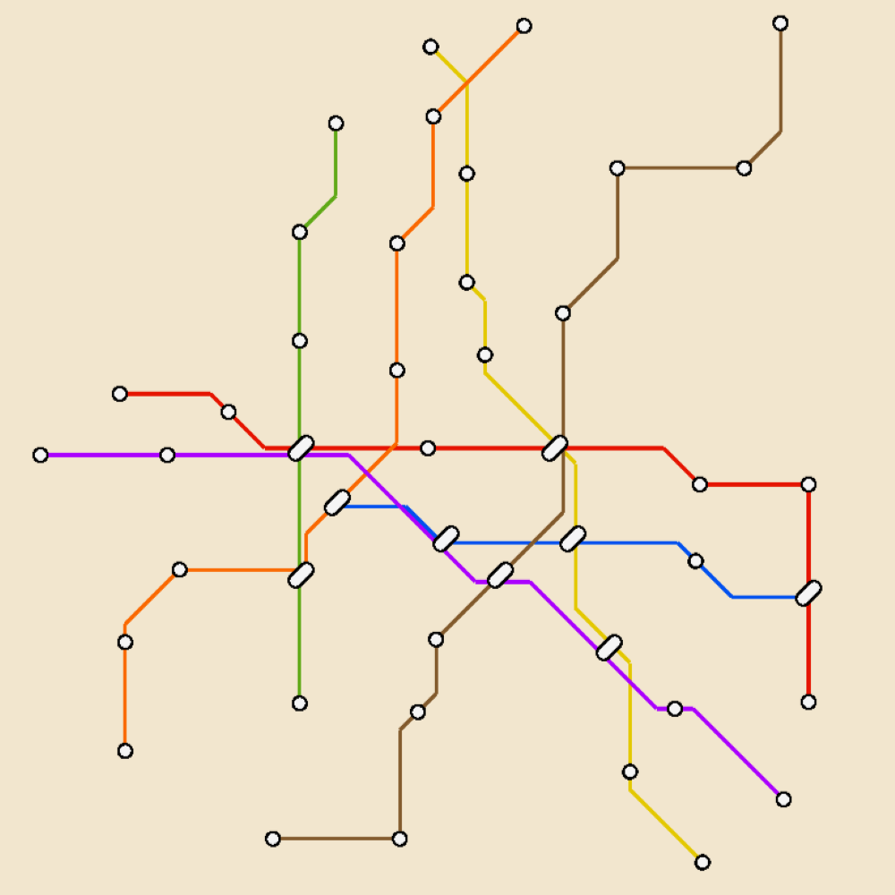
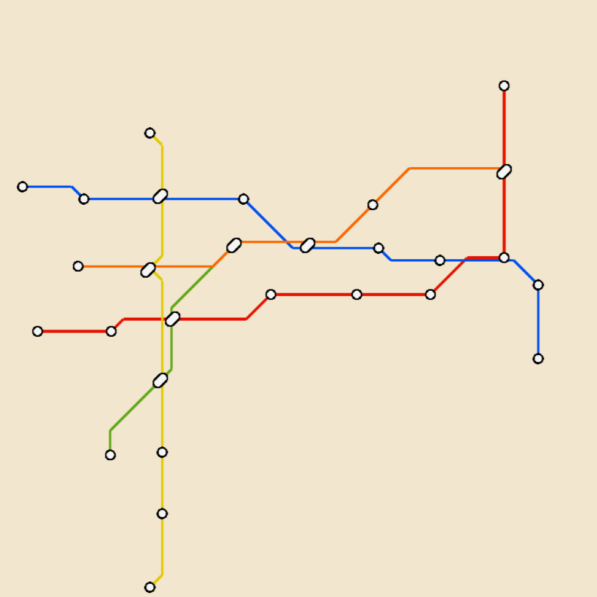
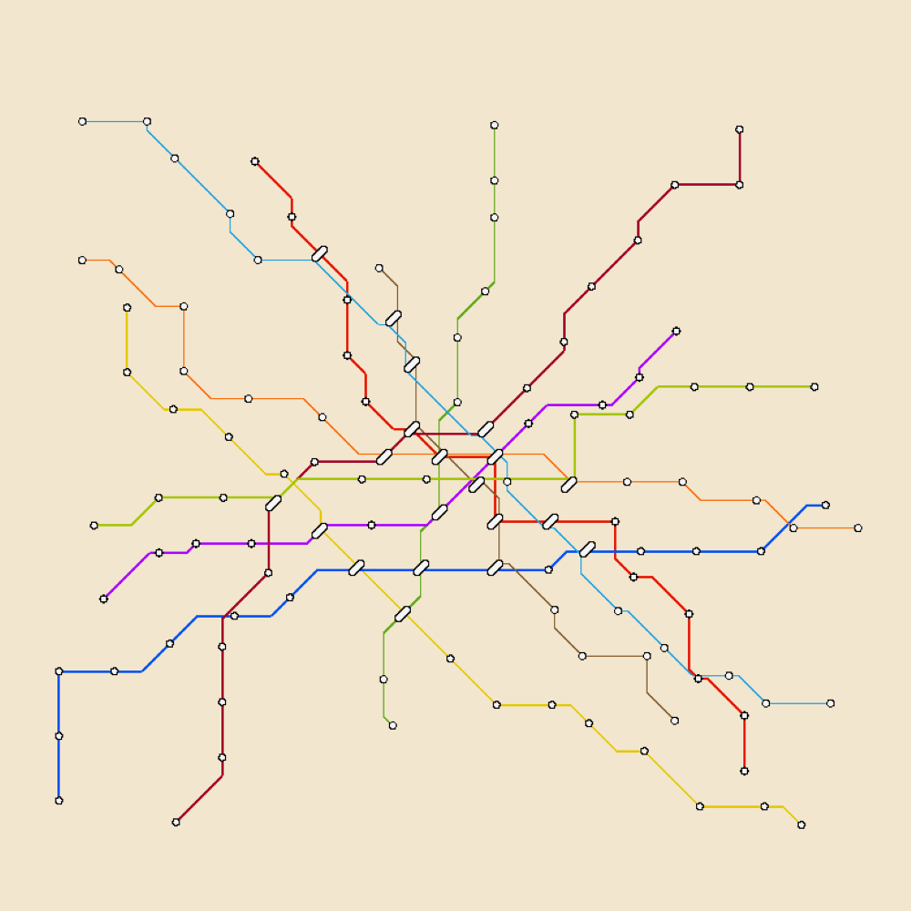

<h1 align="center">

 
Metro Generator
</h1>
<h6 align="center">
A tool for generating metro transit maps
</h6>
 

## Download

The project has been uploaded to [itch.io](https://wayoung7.itch.io/metro-generator). You can try the online tool, or download the windows desktop version from itch.io downloading page. The software is totally free. 

## Usage

Tweak the parameters in **Settings** window and hit **Generate**. If you are using windows desktop version, you can export the image to your computer.

## Showcase

  
  
  

  
  

